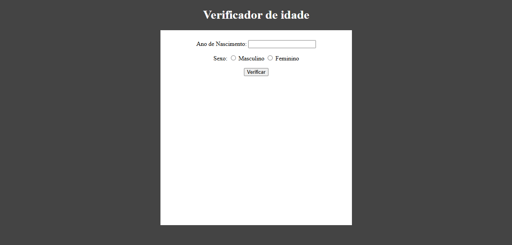

# Verificador de Idade

Este projeto consiste em uma aplicação web simples que permite ao usuário verificar sua idade com base no ano de nascimento informado e no gênero selecionado. Além disso, a aplicação exibe uma imagem correspondente à faixa etária e gênero do usuário.

## Funcionalidades

* **Verificação de Idade:** Calcula a idade do usuário com base no ano de nascimento fornecido.
* **Seleção de Gênero:** Permite ao usuário selecionar entre os gêneros masculino e feminino.
* **Exibição de Imagem:** Mostra uma imagem representativa da faixa etária e gênero do usuário.
* **Responsividade:** A aplicação se adapta a diferentes tamanhos de tela, proporcionando uma boa experiência em dispositivos móveis.
* **Validação de Dados:** Verifica se o ano de nascimento é válido e exibe um alerta caso os dados sejam inválidos.

## Tecnologias Utilizadas

* **HTML:** Estrutura da página web.
* **CSS:** Estilização da página web, incluindo responsividade.
* **JavaScript:** Lógica da aplicação, incluindo cálculo da idade, seleção de imagem e validação de dados.
